<div align="center">
    <h1>🎨 Design Intent for Spec-Driven Development</h1>
    <h3><em>If design systems are your language, design intent is your dialect</em></h3>
</div>

<p align="center">
    <strong>A design consistency layer for AI-driven development teams using <a href="https://github.com/github/spec-kit">Github/Spec Kit</a>. Captures how your team specifically applies design systems.</strong>
</p>

## 📑 Table of Contents

- [✨ Before & After](#-before--after)
- [🎯 What is Design Intent?](#-what-is-design-intent)
- [📋 Prerequisites](#-prerequisites)
- [🚀 Getting Started](#-getting-started)
- [🔄 Design Intent Workflow](#-design-intent-workflow)
  - [Visual Implementation](#1-visual-implementation-design)
  - [Spec-Driven Implementation](#2-spec-driven-implementation-feature--plan--implement)
  - [Pattern Documentation](#3-pattern-documentation-document-design-intent)
- [⌨️ Key Commands](#️-key-commands)
- [📁 File Structure](#-file-structure)
- [💡 Examples of Design Intent](#-examples-of-design-intent)


---


## ✨ Before & After

Same codebase, same prompts, same Figma designs - but different results with and without design intent.

<table style="width: 100%; table-layout: fixed;">
<tr style="width: 100%;">
<td style="width: 33%; vertical-align: top;">

Figma original
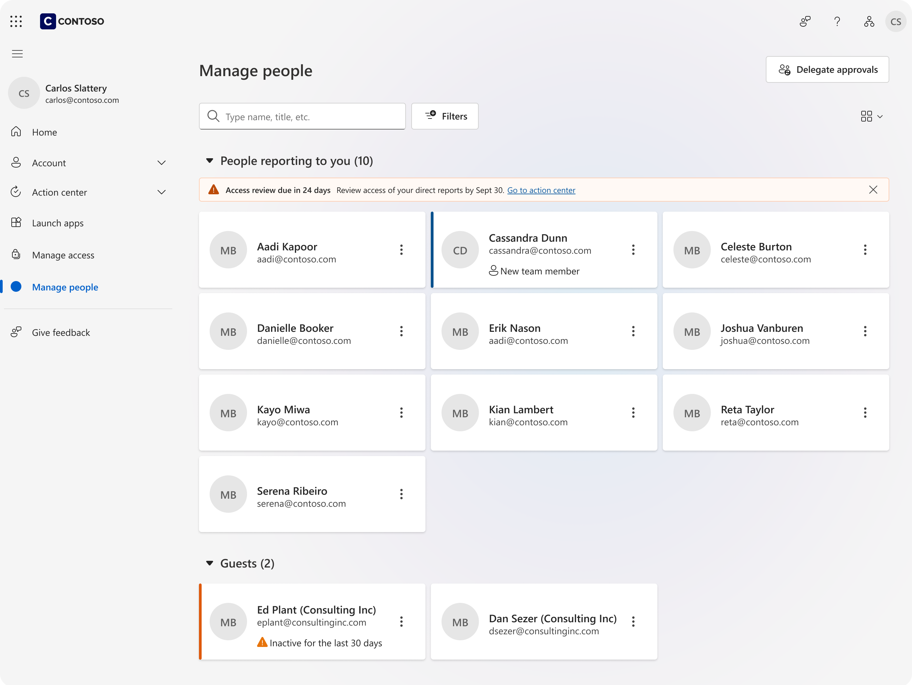

</td>
<td style="width: 33%; vertical-align: top;">

Coded WITH design intent
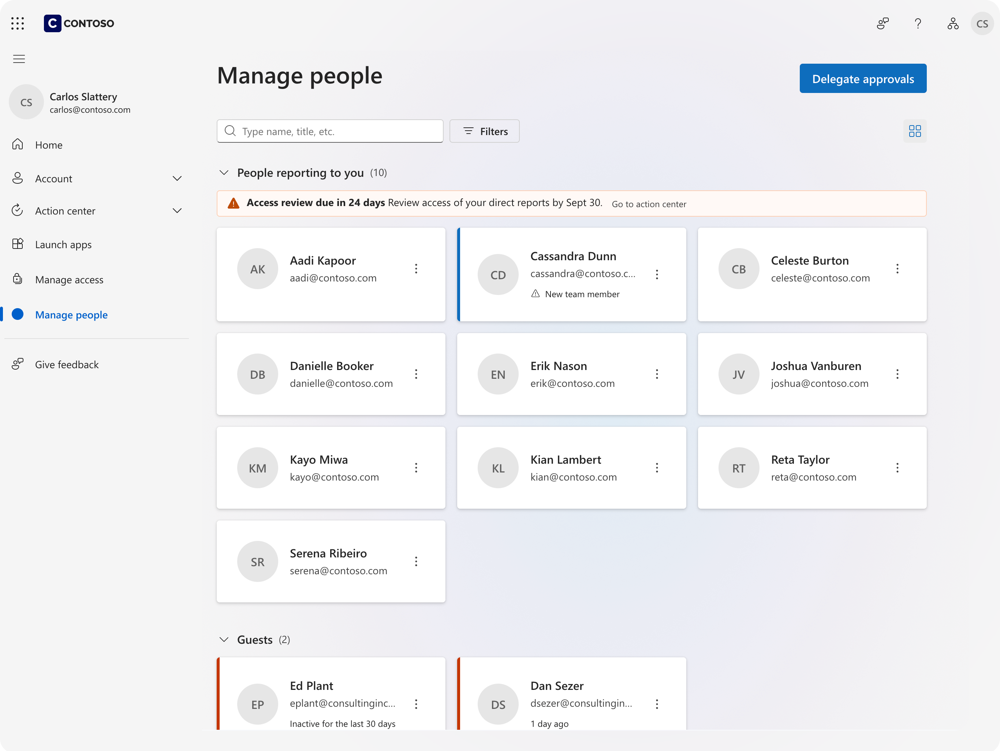

</td>
<td style="width: 33%; vertical-align: top;">

Coded WITHOUT design intent
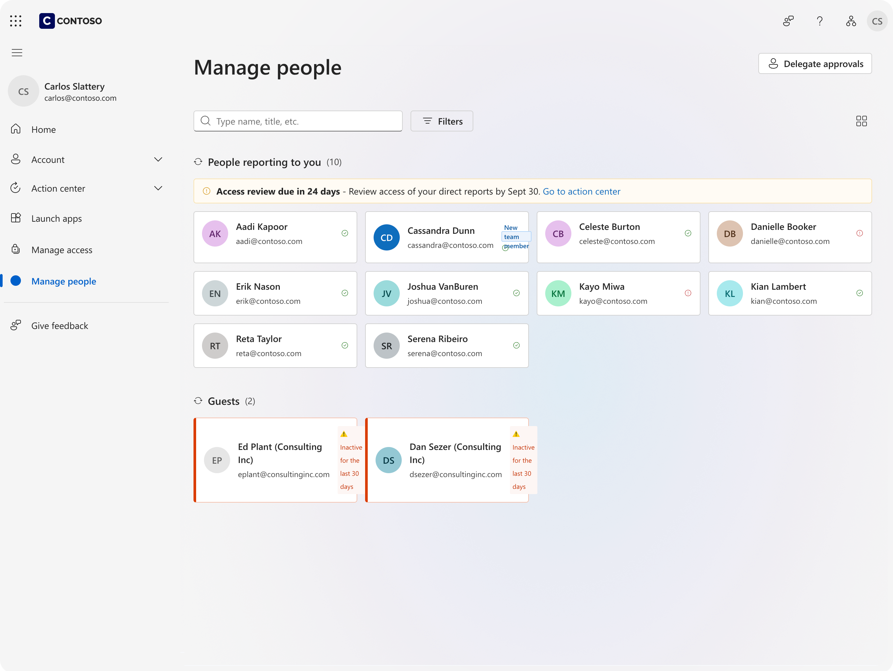

</td>
</tr>
</table>


### Main action on page
<table style="width: 100%; table-layout: fixed;">
<tr>
<td style="width: 50%; vertical-align: top;">

With Design Intent
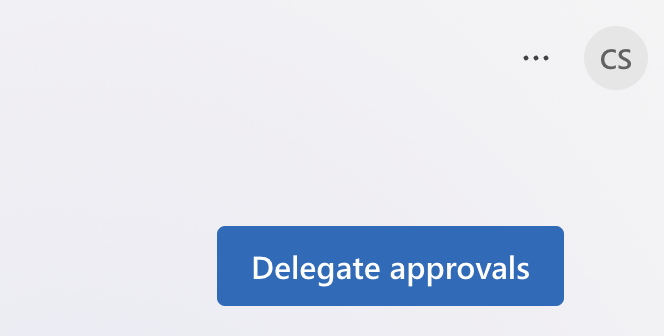

</td>
<td style="width: 50%; vertical-align: top;">

Without Design Intent
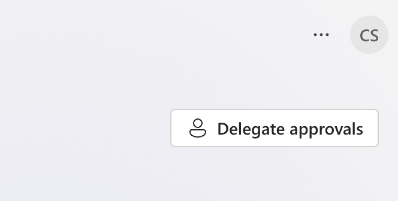

</td>
</tr>
</table>

- Button uses 'Large' size per design intent (not default 'Medium')
- Uses 'Primary' appearance per intent for main actions (not Figma's 'Secondary')


### Correct Fluent components
<table style="width: 100%; table-layout: fixed;">
<tr>
<td style="width: 50%; vertical-align: top;">

With Design Intent
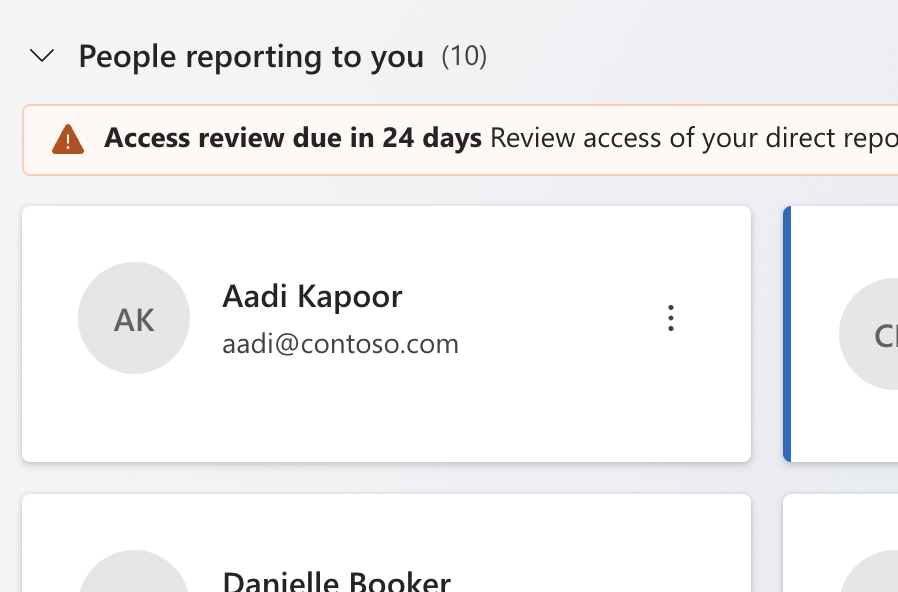

</td>
<td style="width: 50%; vertical-align: top;">

Without Design Intent
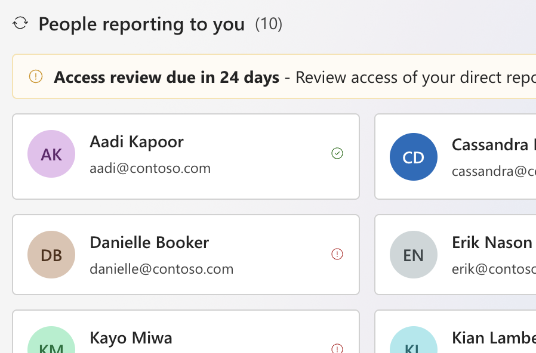

</td>
</tr>
</table>

- Reused existing design system component (not built from scratch)


### Keyboard tab behavior (Accessibility)
<table style="width: 100%; table-layout: fixed;">
<tr>
<td style="width: 50%; vertical-align: top;">

With Design Intent
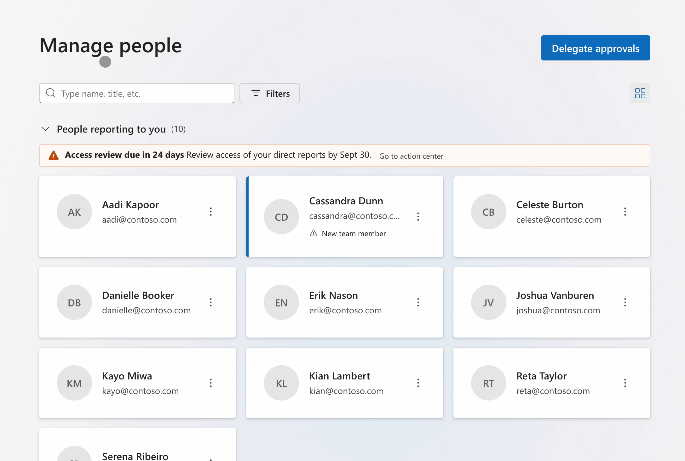

</td>
<td style="width: 50%; vertical-align: top;">

Without Design Intent
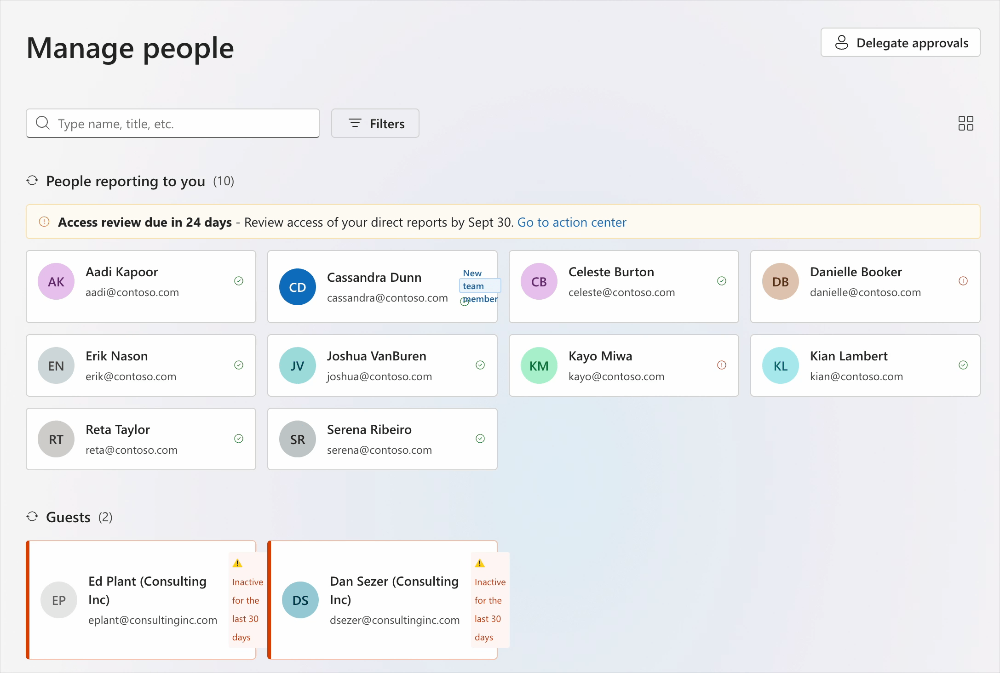

</td>
</tr>
</table>

- Correct keyboard tab behavior per accessibility compliance rules


### Correct page template
<table style="width: 100%; table-layout: fixed;">
<tr>
<td style="width: 50%; vertical-align: top;">

With Design Intent
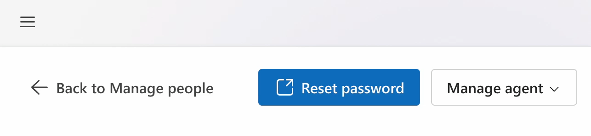

</td>
<td style="width: 50%; vertical-align: top;">

Without Design Intent
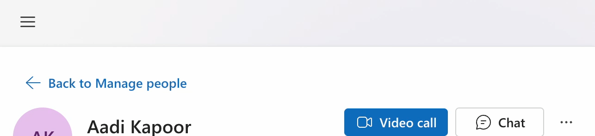

</td>
</tr>
</table>

- Follows correct page template with top navigation (back button + responsive action buttons)
- Custom responsive behavior proves intent was used (too specific to be naturally generated)


---


## 🎯 What is Design Intent?

**Design systems** provide the universal language - components, tokens, patterns that work everywhere.

**Design intent** captures your dialect - how your team specifically applies that language for your unique context.

### Language vs. Dialect Examples

**Language (Design System)**: Data display components (tables, cards, carousels)  
**Your Dialect**:
- **Enterprise**: "We default to tables for displaying data because users need to compare many items and export functionality"
- **Consumer**: "We use card grids and carousels because users browse smaller sets and prioritize visual appeal over density"

**Language (Design System)**: Standard spacing scale (8px, 16px, 24px...)  
**Your Dialect**:
- **Enterprise**: "We use 32px between sections for clear information hierarchy in dense dashboards"
- **Consumer**: "We use 48px between sections to create breathing room and reduce cognitive load"


## 📋 Prerequisites

**Learn spec-driven development first**: [github/spec-kit](https://github.com/github/spec-kit)

This project adds design intent workflows on top of spec-driven development as defined by the work and research of [John Lam](https://github.com/jflam). You'll need to understand feature specs and implementation plans before adding design consistency.


## 🚀 Getting Started

**Dependencies:** Claude Code and Figma MCP server

```bash
git clone https://github.com/HugoPalomares/design-intent-for-sdd.git
cd design-intent-for-sdd
```

**Onboard your AI:**
```
Onboard yourself to this project by reading the CLAUDE.md file before we can continue.
```

✅ **AI now understands the design intent workflow and available commands**


## 🔄 Design Intent Workflow

### 1. Visual Implementation (`/design`)

When you have visual references to implement directly:

```
/design [screenshot of dashboard]
```

**What happens:**
- Launches Design Intent Specialist (custom Claude Code sub-agent) for visual accuracy
- Reviews existing design patterns for consistency  
- Implements section by section (header, nav, main, footer)
- Handles conflicts between reference and existing patterns

### 2. Spec-Driven Implementation (`/feature` → `/plan` → `/implement`)

When building from feature specifications:

```
/feature "User dashboard with metrics widgets"
/plan
/implement
```

**What happens:**
- Create feature specification with `/feature`
- Generate implementation plan with `/plan`
- Execute plan with `/implement` (uses `/design` internally for UI components)
- Coordinates full-stack implementation while maintaining design consistency

### 3. Pattern Documentation (`/document-design-intent`)

After implementing and iteratively improving your app, reflect on patterns worth preserving:

```
/document-design-intent
```

**What happens:**
- Analyzes your iterative improvements and suggests which design decisions are worth preserving
- Presents summary for your review - **you choose what to document**
- Documents only your custom design dialect, not standard design system artifacts


## ⌨️ Key Commands

- `/feature [description]` - Create feature specification
- `/plan` - Generate implementation plan  
- `/design [reference]` - Implement from visual references
- `/implement` - Execute feature plan (design + engineering)
- `/document-design-intent` - Analyze and suggest design patterns to preserve
- `/diary` - Save session context and next steps for future agents


## 📁 File Structure

```
/design-intent/
  /components/        # Component-specific patterns
  /foundations/       # Base design decisions  
  /patterns/          # Layout and composition patterns
  design-intent-template.md  # Template for new patterns

/specs/               # Feature specifications and plans
/diary/               # Session documentation  
/memory/              # Project context and principlesThank you. 
```


## 💡 Examples of Design Intent

**Element:** Header of L2 main section. 

**Pattern used:** `/design-intent/patterns/l2-layout.md`. 

```markdown
(Excerpt)...
## Decision
Use a consistent header structure with back navigation on the left, action buttons on the right using large variant, and responsive overflow menu behavior when space is constrained.

## When to Use
All L2 detail pages that require back navigation and action buttons (person details, agent details, etc.).

## Components
- Button (large variant)
- OverflowButton 
- Existing responsive overflow menu pattern

## Why
Provides consistent navigation experience, maintains action accessibility across screen sizes, and ensures all actions remain discoverable regardless of screen width.

## Dependencies
- OverflowButton component with responsive menu behavior
- Large button variant from Fluent UI
- Page layout system
...
```

**Element:** Table.


**Pattern used:** `/design-intent/component/data-table.md`


```markdown
(Excerpt)...
## Decision
Fluent Table-based implementation with integrated skeleton loading, intelligent state management, and flexible column sizing

## When to Use
- **Structured data display**: Lists, directories, catalogs requiring tabular presentation
- **Interactive data**: Content that users scan, sort, filter, or select
- **Performance requirements**: Large datasets needing loading states and pagination
- **Consistent behavior**: Standardized table interactions across application

## Components
- `DataTable` - Main reusable table component
- `Skeleton` loading states for initial and infinite scroll loading
- Fluent Table components for base functionality

## Why
Migrated from DataGrid to Table for better column sizing control; skeleton loading prevents jarring content shifts; intelligent state management optimizes perceived performance; flexible column sizing adapts to content naturally

## Dependencies
Fluent UI Table components, Skeleton components, infinite scroll utilities, responsive breakpoint system
...
```


